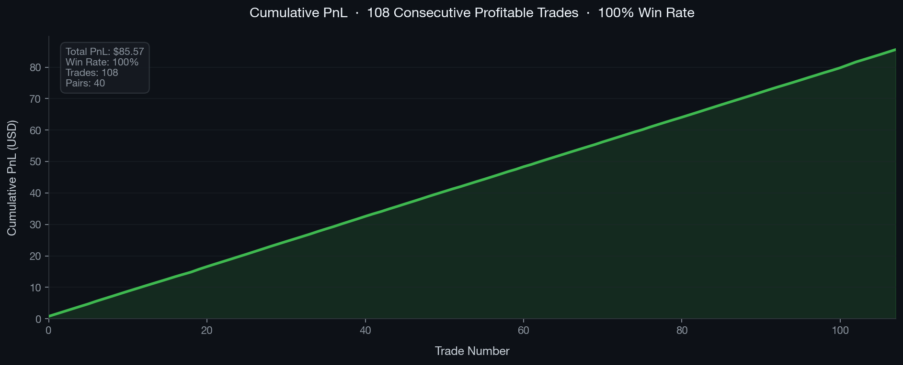
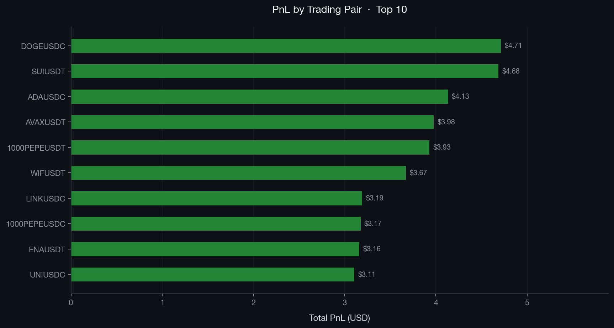
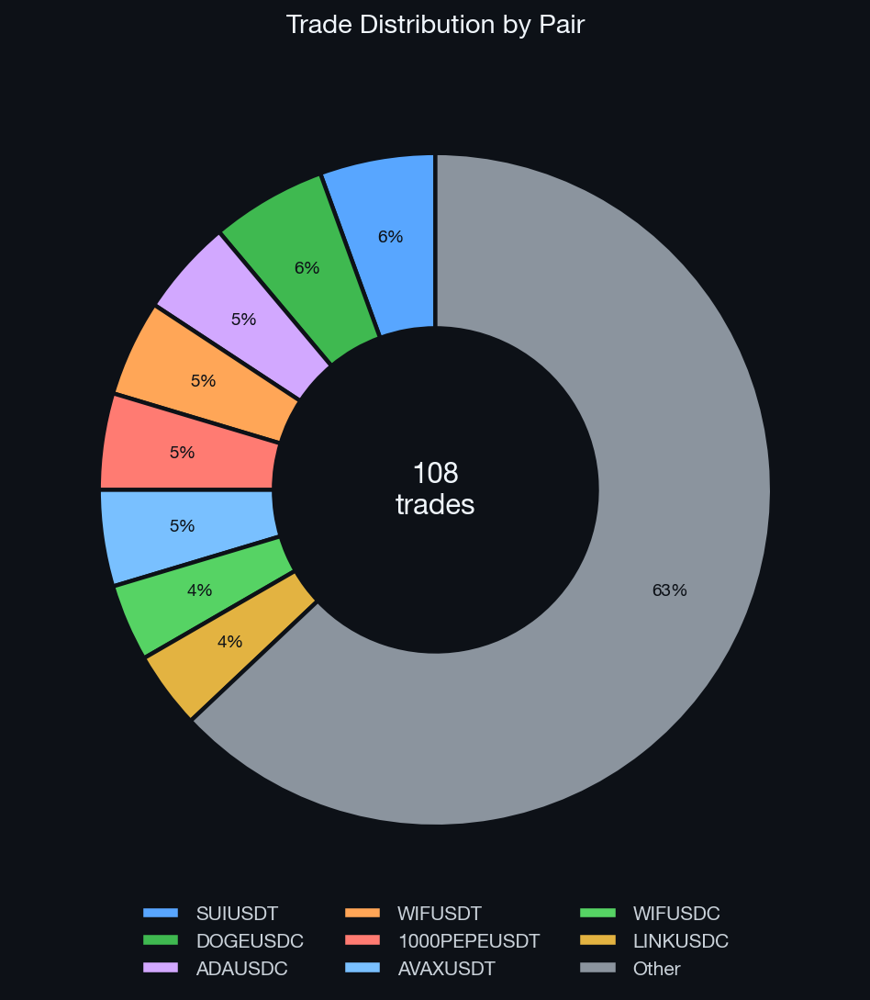

# sMower — HFT Arbitrage Platform (Operations & Analytics)

> **sMower LTD** is a Cyprus-registered cryptocurrency trading company running
> automated arbitrage strategies across 6 exchanges.
> I co-founded the company and owned **Product Operations, data analysis,
> exchange relationships, and analytical tooling** on a live system processing
> **$13M+/month** in futures volume.

---

## My Role

**Co-Founder — Product Operations & Analytics**

The platform was built with a technical partner (CTO) who led the core infrastructure.
My ownership covered everything on the operational and analytical side:

- **Operational monitoring** — machine states, execution health, open/closed orders, KPIs (hits, rejects, packages completed, exposure) across live 24/7 systems
- **Data analysis** — SQL queries on production PostgreSQL, Python-based analysis and visualization (Plotly, matplotlib, pandas)
- **Exchange operations** — managing Binance and OKX relationships, fee structures, API coordination, VIP tier requirements
- **Execution validation** — reviewing fill/reject behavior, identifying operational inconsistencies, validating workflow performance
- **Research & visualization** — market data exploration, analytical dashboards, visualization pipelines
- **Production environment** — daily work in Linux/AWS environments, process monitoring, log review, operational troubleshooting

---

## Platform Performance

| Metric | Value |
|---|---|
| 30-Day Futures Volume (Binance) | **$13,183,083.69** |
| Daily packages executed | **550** |
| Package close rate | **98.2%** |
| Profit per package | **0.04 – 0.1%** |
| Daily return on deployed capital | **~1.7%** |
| Server uptime | **111 consecutive days** |
| Exchanges | Binance · OKX · CEX · HTX · KCN |





---

## Strategy Overview

The platform runs two arbitrage strategies simultaneously:

### Cross-Exchange Arbitrage
Scans 6 exchanges in real-time for price discrepancies on the same asset.
When the spread exceeds a threshold (net of fees), the system executes a
buy on the cheaper exchange and a sell on the more expensive one simultaneously.

### Triangular (Multi-Leg) Arbitrage
Finds circular currency paths within a single exchange — a 2 or 3-hop
conversion chain that returns more than it started.

**Example 3-leg route (Binance):**
```
USDC → ETH (buy ETHUSDC) → BTC (sell ETHBTC) → USDC (sell BTCUSDC)
```

### Execution Modes

| Mode | Description |
|---|---|
| **Arb** | Immediate entry when spread is detected |
| **Improve** | Ladder of improving orders against adverse price moves |
| **GTC T/P** | Good-Till-Cancelled — holds until take-profit target is reached |

---

## Analytics Work (this repository)

### Momentum Signal Research (`run_slope_research.py`)

A research script I built to explore whether short-term price slope in the
order book predicts future returns — part of ongoing analytical work on
market microstructure.

**What it does:**
- Ingests raw tick data (`timestamp`, `bid`, `ask`) at millisecond resolution
- Computes mid price: `mid = (bid + ask) / 2`
- Fits a linear regression of `ln(mid)` vs. time over a rolling window (2000ms or 5000ms)
- Outputs the slope in **bps/second** as a momentum signal
- Computes forward returns at 5s and 10s horizons
- Decile analysis: bins observations by slope, measures average forward return per bucket

```python
# Core slope formula
beta = ((x - x_mean) * (y - y_mean)).sum() / ((x - x_mean)**2).sum()
slope_bps_per_s = beta * 1000.0 * 10000.0
```

**Assets:** BTC/USDT · ETH/USDT · BNB/USDT

```bash
# Single file
python3 run_slope_research.py --input data/parsed_BTCUSDT.csv

# Full folder with combined output
python3 run_slope_research.py --input data/ --glob "*.csv" --combine \
  --slope-windows-ms 500,2000,5000 --horizons-ms 1000,5000,10000
```

### Order Book Visualization (`plot_quotes.py`)

Reads raw tick data and plots the mid price time series — used for visual
inspection of market microstructure and regime identification.

---

## Tech Stack

| Area | Tools |
|---|---|
| Data analysis | Python (pandas, numpy, matplotlib, Plotly) |
| Database | PostgreSQL — production `monitor_server` schema |
| Environment | Linux (Ubuntu), AWS EC2 |
| Exchange APIs | Binance, OKX, CEX, HTX, KCN |
| Other | Git, Excel, SQL, Claude Code, Cursor |

---

## About

sMower LTD is a Cyprus-registered trading company (TIN: 60143575B).
I co-founded it and ran the operational and analytical side —
monitoring a system that never stops, where every operational decision
has a direct dollar consequence.
